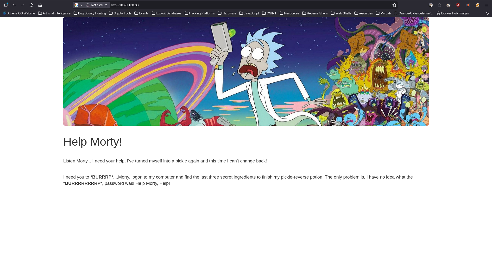
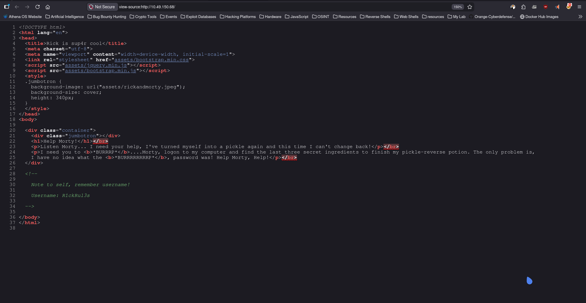
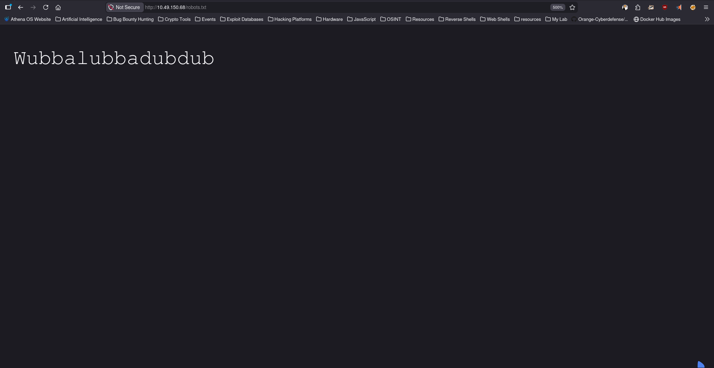
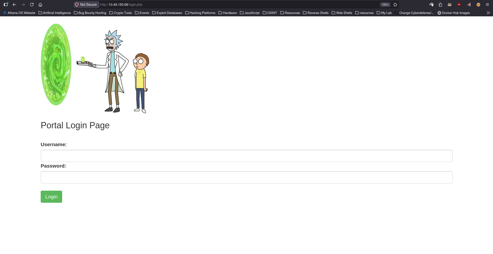
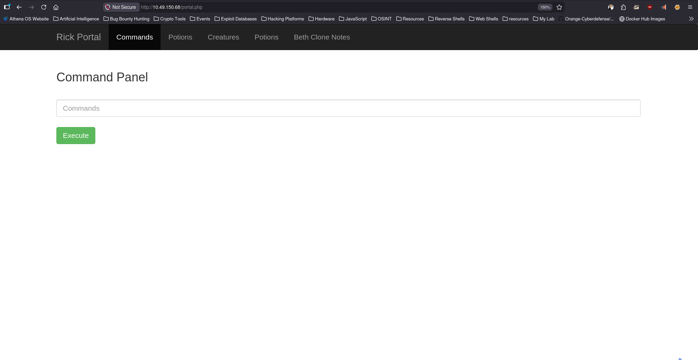
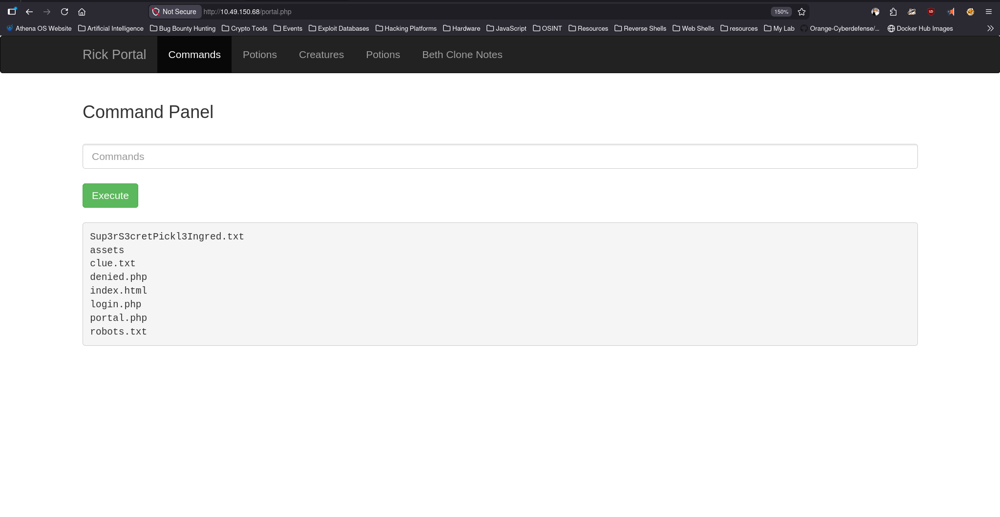
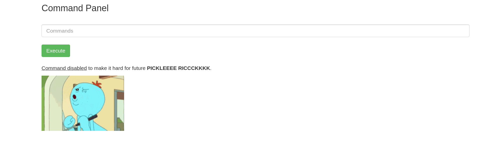

# Pickle Rick

**Platform:** TryHackMe  
**Difficulty:** Easy  
**Category:** Red Team  

## Overview
A Rick and Morty CTF. Help turn Rick back into a human!

This Rick and Morty-themed challenge requires you to exploit a web server and find three ingredients to help Rick make his potion and transform himself back into a human from a pickle.

## Enumeration

### Command Used
```bash
sudo nmap 10.49.150.68 -n -T4 -sC -sV -oN Nmap-Scan
```
### Nmap Result
```ansi
Starting Nmap 7.98 ( https://nmap.org ) at 2026-03-26 12:32 +0530
Nmap scan report for 10.49.150.68
Host is up (0.0093s latency).
Not shown: 998 closed tcp ports (reset)
PORT   STATE SERVICE VERSION
22/tcp open  ssh     OpenSSH 8.2p1 Ubuntu 4ubuntu0.11 (Ubuntu Linux; protocol 2.0)
| ssh-hostkey: 
|   3072 bb:28:b6:e9:bd:d5:8d:e0:dc:9c:56:d7:9f:ce:79:9e (RSA)
|   256 ab:58:07:1f:61:ac:70:25:7b:ed:77:ef:17:75:d4:d8 (ECDSA)
|_  256 03:22:df:aa:d3:4c:47:b8:04:7e:27:aa:93:e1:77:ea (ED25519)
80/tcp open  http    Apache httpd 2.4.41 ((Ubuntu))
|_http-title: Rick is sup4r cool
|_http-server-header: Apache/2.4.41 (Ubuntu)
Service Info: OS: Linux; CPE: cpe:/o:linux:linux_kernel

Service detection performed. Please report any incorrect results at https://nmap.org/submit/ .
Nmap done: 1 IP address (1 host up) scanned in 32.80 seconds
```
### Analysis

Based on the Nmap results:

- Port 22 (SSH) → Possible brute-force or credential reuse
- Port 80 (HTTP) → Web application to enumerate

### Web Enumeration

Accessed:
- http://10.49.150.68/

### Homepage 



### Source Code 



- /robots.txt Found with a Text looks like Credential.
- Homepage Source code having Note which disclose Username
```ansi
<!--

    Note to self, remember username!

    Username: R1ckRul3s

  -->
```
### /robots.txt 


## Directory & File Brute Forcing

### Command Used
```bash
sudo feroxbuster -u http://10.49.150.68/ -w /usr/share/seclists/Discovery/Web-Content/DirBuster-2007_directory-list-2.3-medium.txt
```
### Found 

http://10.49.150.68/assets/ (Not Useful)

## Vulnerability Scanning

### Command Used 
```bash
sudo nikto -h 10.49.150.68
```
### Output 
```ansi
┌─[zeref@Athena]─[~/TryHackMe/Pickle-Rick]─[192.168.137.158]
└──╼ $ sudo nikto -h 10.49.150.68                         
- Nikto v2.6.0
---------------------------------------------------------------------------
+ Your Nikto installation is out of date.
+ Target IP:          10.49.150.68
+ Target Hostname:    10.49.150.68
+ Target Port:        80
+ Platform:           Unknown
+ Start Time:         2026-03-26 12:52:02 (GMT5.5)
---------------------------------------------------------------------------
+ Server: Apache/2.4.41 (Ubuntu)
+ No CGI Directories found (use '-C all' to force check all possible dirs). CGI tests skipped.
+ [600050] Apache/2.4.41 appears to be outdated (current is at least 2.4.66).
+ [999984] /: Server may leak inodes via ETags, header found with file /, inode: 426, size: 5818ccf125686, mtime: gzip. See: https://cve.mitre.org/cgi-bin/cvename.cgi?name=CVE-2003-1418
+ [013587] /: Suggested security header missing: x-content-type-options. See: https://developer.mozilla.org/en-US/docs/Web/HTTP/Headers/X-Content-Type-Options
+ [013587] /: Suggested security header missing: content-security-policy. See: https://developer.mozilla.org/en-US/docs/Web/HTTP/CSP
+ [013587] /: Suggested security header missing: permissions-policy. See: https://developer.mozilla.org/en-US/docs/Web/HTTP/Headers/Permissions-Policy
+ [013587] /: Suggested security header missing: strict-transport-security. See: https://developer.mozilla.org/en-US/docs/Web/HTTP/Headers/Strict-Transport-Security
+ [013587] /: Suggested security header missing: referrer-policy. See: https://developer.mozilla.org/en-US/docs/Web/HTTP/Headers/Referrer-Policy
+ [95] /login.php: Cookie PHPSESSID created without the httponly flag. See: https://developer.mozilla.org/en-US/docs/Web/HTTP/Cookies
+ [999990] OPTIONS: Allowed HTTP Methods: GET, POST, OPTIONS, HEAD .
+ [006333] /login.php: Admin login page/section found.
```
### Found 
```bash
/login.php
```
### /login.php



- Login using the Credentials we found in /robots.txt and and source code
- After logged in we can see a Command Panel in which we can execute Commands



- It is a Restricted Shell




